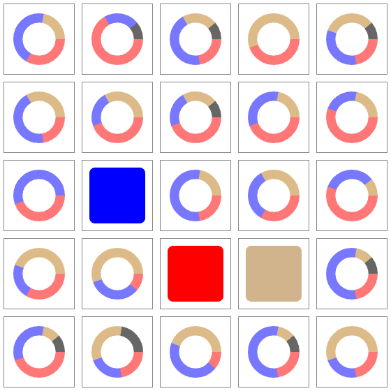

# Solver for Codenames #

[Codenames is a boardgame](https://en.wikipedia.org/wiki/Codenames_(board_game)) by Vladimír Chvátil. Aside from the designated codemasters, the players are trying to determine which squares belong to their team based hints provided by the codemaster. The game comes printed with 40 solution cards (which can be rotated 4 ways), leading to a total of 160 possible solutions.

This solver hard-codes all solutions. Given the set of squares which have been revealed so far, the solver provides a pie chart for each remaining square in the game. The pie chart represents the probability that the square may belong to the blue team, red team, neutral team, or an assassin.

Example screenshot:

In the above example, 3 sqaures have been revealed so far: for the blue team (row 3, column 2), for the red team (row 4, column 3), and for the netral team (row 4, column 4). All the remaining squares show a pie chart of the probability of what the square may actually be.

The solver exists as a single static HTML page, [which you can use it here](https://htmlpreview.github.io/?https://raw.githubusercontent.com/dsnet/codebreaker/master/index.html).
